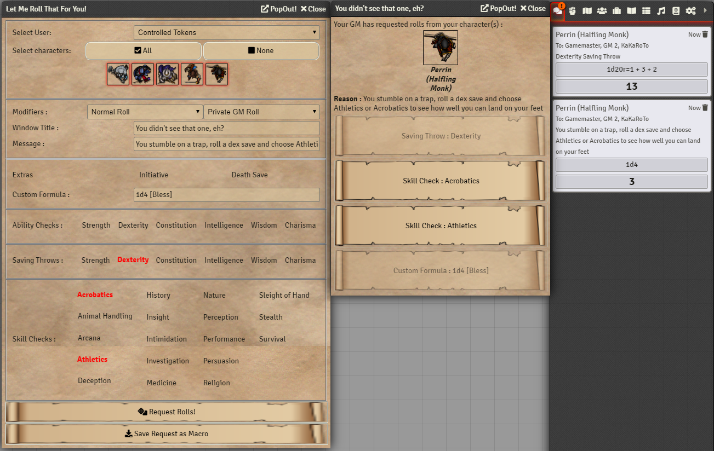

# Let Me Roll That For You!

LMRTFY is a module to let Game Masters request rolls from their players. This can help avoid questions like "where do I click again?" or maybe simply to request a roll without the other players knowing about it.

Writing this module was the idea of iotech, based on the Fantasy Grounds "[Roll For Initiative](https://www.fantasygrounds.com/forums/showthread.php?45234)" extension. Iotech also designed and wrote the UI for it.

## Currently Supported Systems:
- dnd5e
- dnd5eJP
- pf2e
- D35E

Your favorite system not on this list? Adding compatibility is easy! Have a look at [CONTRIBUTING.md](/CONTRIBUTING.md) and open a PR!

## Installation

You can now install this module automatically by specifying the following public module URL : `https://github.com/League-of-Foundry-Developers/fvtt-module-lmrtfy/releases/latest/download/module.json`

As GM go to the `Manage Modules` options menu in your World Settings tab then enable the `Let Me Roll That For You!` module.

## License
This Foundry VTT module, writen by KaKaRoTo, is licensed under a [Creative Commons Attribution 4.0 International License](http://creativecommons.org/licenses/by/4.0/).

This work is licensed under Foundry Virtual Tabletop [EULA - Limited License Agreement for module development v 0.1.6](http://foundryvtt.com/pages/license.html).

## Attributions

Japanese translation by `@Brother Sharp`
German translation by `@Acd-Jake`
Portuguese translation by `@rinnocenti`
Spanish translation by `@SanaRinomi`